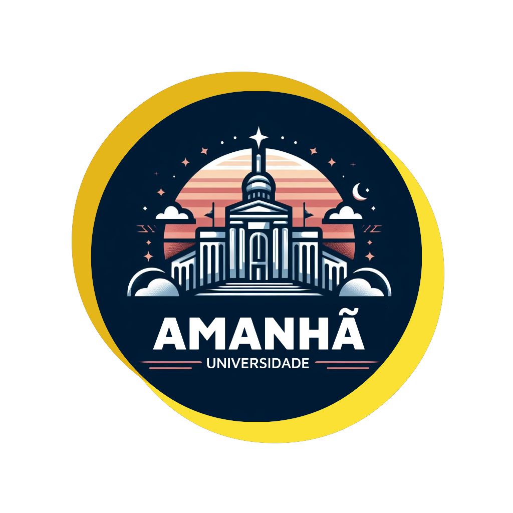
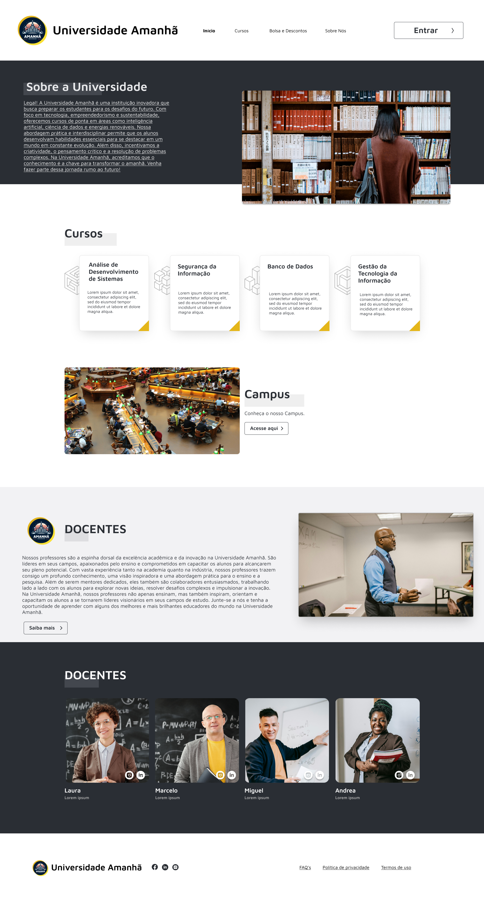

# Projeto Integrador - SENAC - Grupo 2
Curso de Tecnologia em Sistemas para Internet.

Integrantes do grupo: 
- Cristiane Silva San Miguel
- Lydson Henrique San Miguel Garcia
- Raphael Honorato e Silva
- Thiago de Holanda Silva
- Tiago Tinoco Martins dos Santos

## Descrição do projeto institucional
Este trabalho de modelagem visa criar um modelo UML (Unified Modeling Language ou Linguagem de Modelagem Unificada) para gerenciamento de dados universitários. Foram criados um diagrama de caso de uso e um diagrama de classe para apontar claramente as interações entre os usuários e o sistema.
Com base no diagrama de caso de uso e nas interações entre os atores nele representados, foram desenvolvidos diferentes cenários considerando as situações e contextos em que um agente utilizará o sistema.
Por fim, foi desenvolvido um protótipo da interface do sistema no Figma seguindo os diagramas de caso de uso feitos na primeira etapa. O nome fictício da instituição foi definido como "Universidade Amanhã" e junto ao projeto desenvolvemos o logotipo mostrado abaixo.
## Links
### Figma
https://www.figma.com/file/uZRhz0VfYnPajJBYv5RIFX/PROJETO-INTEGRADOR-GRUPO-2-SENAC?type=design&node-id=0%3A1&mode=design&t=JBMqiUoYn5DUM03P-1
### Trabalho completo no Google Docs
https://docs.google.com/document/d/1mV7hO4vUEnDlLTwVJ7mgkgLZgkIoq7m5/edit?usp=sharing&ouid=106588193809845621504&rtpof=true&sd=true
## Diagrama de Caso de Uso

## Diagrama de Classe 

## Logo Universidade Amanhã

## Prints do protótipo da interface do sistema no Figma

<IMAGENS FIGMA> 
